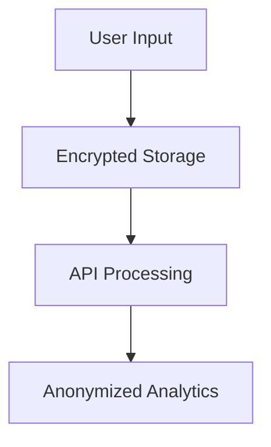

# GDPR Compliance

## Data Collection
- **User Inputs**: Stored encrypted (AES-256)
- **API Logs**: Automatically purged after 30 days

## Right to Erasure
Trigger deletion via:
```php
\AdvancedAIO_WP\Security\GDPR_Tools::erase_user_data($user_id);
```

## Data Flow

